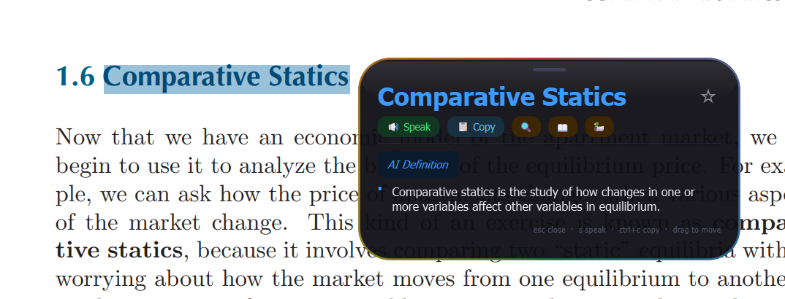
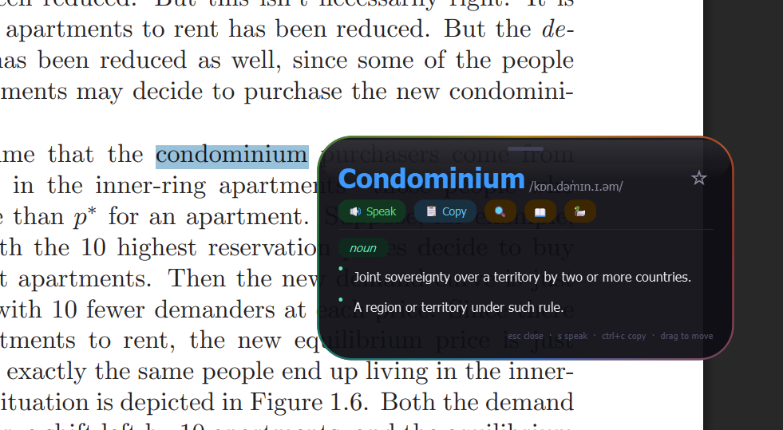

# Word Lookup Popup for Windows

Mac-style "Look Up" popup for Windows using global hotkeys.

Select text anywhere, press a shortcut, and get a clean popup definition near your cursor.

## Features

- Global hotkey lookup: `Alt+Shift+D`
- Fallback hotkey: `Ctrl+Alt+D`
- `Ctrl+H` opens lookup history
- `Ctrl+L` opens saved favorites
- `Ctrl+F` favorites the current word
- `S` plays pronunciation via TTS
- Uses free online dictionary API first
- Falls back to local Ollama AI definitions with an `AI Definition` result
- Supports phrase explanation (plain English) via Ollama
- Works in browsers, PDFs, and regular desktop apps

## Requirements

- Windows 10/11
- Python 3.10+
- Administrator privileges (required for global hotkeys)

## Install

```bash
python -m venv .venv
.venv\Scripts\activate
pip install -r requirements.txt
# or: pip install -e .
```

## Optional Ollama Setup

Install Ollama and pull a model:

```bash
ollama pull llama3
ollama serve
```

The script expects Ollama at `http://localhost:11434`.

## Run

```bash
python word_lookup.py
```

Use as Administrator for reliable global shortcut behavior.

## Screenshot



*Screenshot showing the AI Definition fallback from Ollama.*



*Screenshot showing the definition from a free api.*

## Usage

1. Select a word (or short phrase) anywhere.
2. Press `Alt+Shift+D` (or `Ctrl+Alt+D`).
3. Popup appears near cursor.
4. Press `Esc` or click away to close.

## Troubleshooting

- If selection is not captured:
  - Ensure the app/PDF has focus.
  - Re-select the text.
  - Run terminal as Administrator.
- If AI fallback fails:
  - Confirm Ollama is running with `ollama serve`.
  - Confirm model exists with `ollama list`.
  - Check `localhost:11434` is reachable.

## Project Structure

```text
.
|- word_lookup.py
|- pyproject.toml
|- requirements.txt
|- README.md
|- LICENSE
`- .gitignore
```

## License

MIT License. See [LICENSE](LICENSE).
